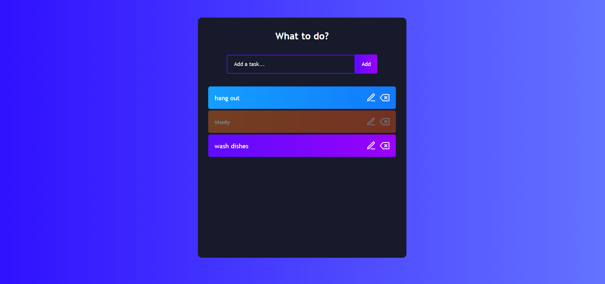

# Todo App

> Todo App is a React application that helps you plan and manage your daily tasks (front-end only).

## Table of Contents
* [General Info](#general-information)
* [Technologies Used](#technologies-used)
* [Screenshots](#screenshots)
* [Setup](#setup)
* [Project Status](#project-status)
* [Contact](#contact)

## General Information
- Todo App was a React application that I created while learning React.

## Technologies Used
- React - version 18.2.

## Screenshots
- Application Screenshot
  
    

## Setup
To run this project, install it locally using npm:

```
$ cd ../react-sidebar
$ npm install
$ npm start
```

## Project Status
Project is: _complete_ .


## Contact
Created by [@ToQuyenPhan](https://www.facebook.com/profile.php?id=100006321400254) - feel free to contact me!
